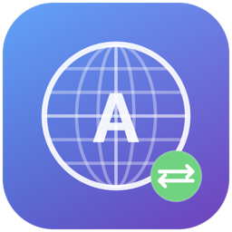

# AutoLang

A lightweight macOS menu bar app that automatically switches your input source to English when you focus on developer tools.

<p align="center">
  
  <br><br>
  <a href="../../releases/latest"></a>
  
  <a href="LICENSE"></a>
</p>

If you use multiple input sources (e.g. Korean + English), you know the pain: you switch to your terminal, start typing a command, and realize you're still on the wrong keyboard. AutoLang fixes this by watching which app is in the foreground and switching to English automatically.

## How It Works

| Trigger | Behavior |
|---------|----------|
| Switch to a terminal app | Instantly switches to English |
| Switch to a browser on a dev site | Detects the URL and switches to English |
| Switch to any other app | Optionally restores your previous input source |

**Terminal apps** (default): Terminal.app, Ghostty

**Dev URL patterns** (default): `github.com`, `graphite.dev`, `gitlab.com`, `stackoverflow.com`

**Browser support**: Safari, Google Chrome, Arc (via AppleScript — you'll be prompted to grant Automation permission on first use)

Everything is configurable from the Settings window.

## Install

### Download

Grab the latest `.dmg` from [Releases](../../releases), open it, and drag **AutoLang** to your Applications folder.

### Build from Source

Requires Xcode and [XcodeGen](https://github.com/yonaskolb/XcodeGen).

```bash
# Build and run
make run

# Or just build
make build

# Package as DMG
make dmg

# Open in Xcode
make open
```

## Usage

AutoLang lives in your menu bar as a globe icon. Click it to:

- **Toggle** the app on/off
- See the **current input source** and switch count
- Open **Settings** to customize rules

### Settings

- **General** — Enable/disable, launch at login, restore previous input on app leave, choose preferred English source, set browser poll interval
- **Apps** — Add/remove apps that always trigger an English switch (uses native app picker)
- **Websites** — Add/remove URL patterns for browser-based switching

## Requirements

- macOS 14.0+
- Xcode 15+ (to build from source)

## Permissions

AutoLang requests **Automation** permission to read browser URLs via AppleScript. This is only used for URL pattern matching and can be revoked at any time in System Settings > Privacy & Security > Automation.

No data is collected or sent anywhere. Everything runs locally.

## License

MIT
